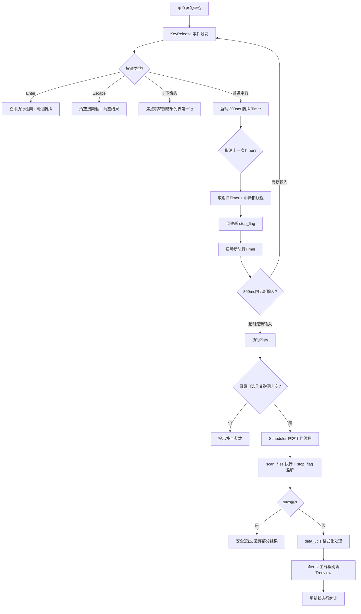
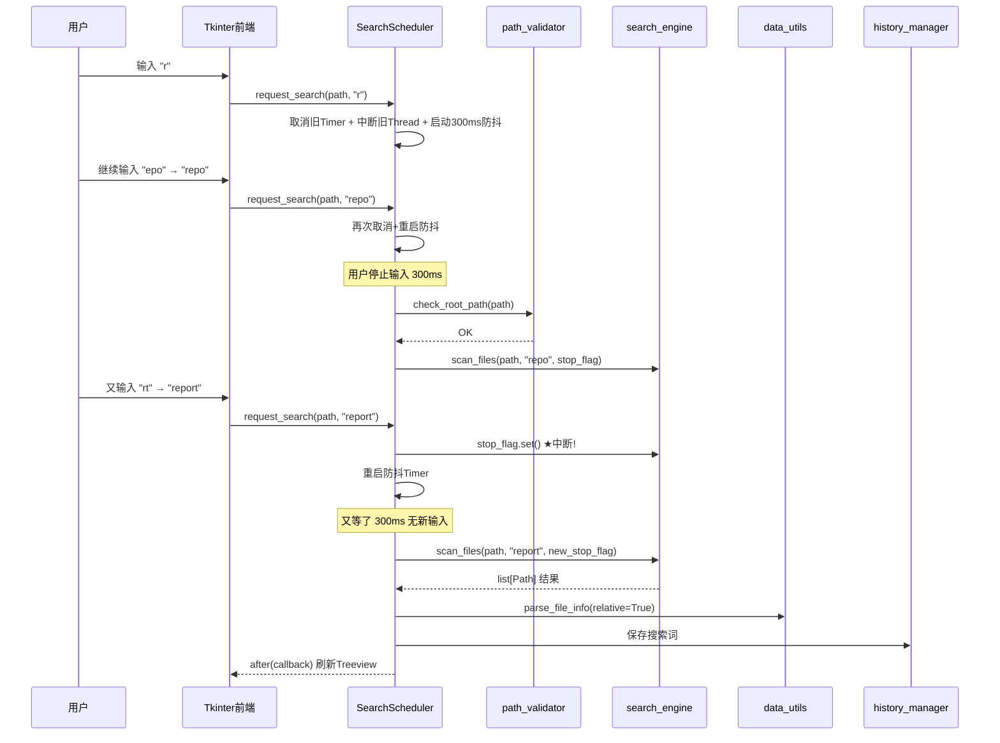

# 仿Everything文件检索系统 — 项目设计方案与实施计划（V2.0）

> **文档版本**：V2.0
> **编制日期**：2026-06-05
> **项目代号**：FileManager-Pro
> **文档状态**：已更新 — 全面对标 Everything 原生体验
> **变更摘要**：从「传统按钮触发检索」升级为「即时搜索 + 键盘驱动 + 系统托盘」的 Everything 模式

***

## 目录

1. [项目概述](#一项目概述)
2. [系统架构设计](#二系统架构设计)
3. [数据库设计](#三数据库设计)
4. [API接口规范](#四api接口规范)
5. [安全策略](#五安全策略)
6. [技术选型](#六技术选型)
7. [开发环境配置](#七开发环境配置)
8. [项目组织结构](#八项目组织结构)
9. [任务分解与进度安排](#九任务分解与进度安排)
10. [资源分配计划](#十资源分配计划)
11. [质量保障措施](#十一质量保障措施)
12. [测试策略](#十二测试策略)
13. [风险管理计划](#十三风险管理计划)
14. [项目交付标准](#十四项目交付标准)

***

## 一、项目概述

### 1.1 项目背景

Everything 是 Windows 平台上最快的本地文件搜索工具，其核心优势在于：

* **即时搜索**（输入即出结果，无需点击搜索按钮）

* **极简 UI**（一个搜索框 + 一张结果列表）

* **键盘完全驱动**（鼠标非必需）

* **系统托盘常驻**（全局热键唤醒）

本项目旨在用 Python + tkinter 复刻 Everything 的核心体验，在满足作业技术约束（pathlib 纯实现）的同时，打造一款真正**像 Everything 一样好用**的文件检索工具。

### 1.2 项目目标

| 目标维度      | 具体描述                     | 对标 Everything |
| --------- | ------------------------ | ------------- |
| **核心目标**  | 即时搜索体验：输入即搜，300ms 防抖     | 完全一致          |
| **性能目标**  | 支持万级文件遍历，响应 < 5s；支持中断和替换 | 中断能力一致        |
| **UI 目标** | 极简 2 区布局（搜索栏+结果列表），纯白主题  | 高度还原          |
| **交互目标**  | 键盘完全驱动，系统托盘 + 全局热键       | 完全一致          |
| **功能目标**  | 通配符/排除语法/多条件AND/筛选/排序/导出 | 核心一致          |
| **技术约束**  | 文件操作全程 `pathlib`，禁用 `os` | 作业要求          |

### 1.3 V2.0 vs V1.0 核心差异

| 维度        | V1.0（旧版）              | V2.0（Everything 风格）       |
| --------- | --------------------- | ------------------------- |
| **搜索方式**  | 点击「开始检索」按钮            | **输入即搜（防抖自动触发）**          |
| **UI 布局** | 5 分区（导航/筛选/列表/详情/状态栏） | **2 分区（搜索栏 + 结果列表）**      |
| **窗口尺寸**  | 1100×720 大窗           | **600×480 小窗，可缩放**        |
| **键盘操作**  | 仅基本操作                 | **全键盘驱动（15+ 快捷键）**        |
| **窗口行为**  | 关闭即退出                 | **关闭最小化到托盘**              |
| **热键**    | 无                     | **Ctrl+Ctrl 全局唤醒**        |
| **后端架构**  | 4 层（前端直调引擎）           | **5 层（新增 Scheduler 调度层）** |
| **线程模型**  | 手动创建 Thread           | **Scheduler 统一管理生命周期**    |
| **中断能力**  | 无                     | **stop\_flag 安全中断**       |

### 1.4 目标用户与场景

* **主要用户**：需要快速定位本地文件的办公人员、开发者、学生

* **核心场景**：按下 Ctrl+Ctrl → 输入关键词 → Enter 打开文件 → 全程 < 3 秒

### 1.5 项目范围

| 包含内容                | 不包含内容                  |
| ------------------- | ---------------------- |
| 指定目录即时递归检索          | NTFS MFT 全盘索引（非实时搜索引擎） |
| 输入即搜（防抖+中断）         | 文件内容全文检索               |
| Everything 风格极简 GUI | Web 版 / 移动端版本          |
| 键盘驱动 + 系统托盘 + 全局热键  | 网络文件 / 云存储检索           |
| 搜索语法（通配符/排除/多条件）    | 正则表达式全文匹配              |
| 筛选 / 排序 / 导出 / 历史记录 | 用户账号 / 权限管理系统          |

***

## 二、系统架构设计

### 2.1 整体架构图（V2.0 更新）

```
┌─────────────────────────────────────────────────────────────┐
│                   表现层 (Presentation)                       │
│  ┌───────────────────────────────────────────────────────┐  │
│  │            Tkinter GUI — Everything 极简风格             │  │
│  │  ┌─────────────────────────────────────────────────┐   │  │
│  │  │ 🔍[搜索框(输入即搜)]                    ⚙️ 🗘    │   │  │
│  │  ├─────────────────────────────────────────────────┤   │  │
│  │  │ 文件名 │ 路径 │ 大小 │ 日期 │ 类型              │   │  │
│  │  │ ...结果列表(Treeview, 占90%空间)...               │   │  │
│  │  ├─────────────────────────────────────────────────┤   │  │
│  │  │ 已找到 N 个文件 (X.XXs)         迷你状态行       │   │  │
│  │  └─────────────────────────────────────────────────┘   │  │
│  └───────────────────────────────────────────────────────┘  │
│  ┌──────────┐  ┌────────────┐                                │
│  │系统托盘图标│  │全局热键注册 │  Ctrl+Ctrl 唤醒               │
│  └──────────┘  └────────────┘                                │
├─────────────────────────────────────────────────────────────┤
│                   业务逻辑层 (Business Layer)                 │
│  ┌───────────────────────────────────────────────────────┐  │
│  │              后端五层模块架构                            │  │
│  │                                                        │  │
│  │  path_validator ─→ search_scheduler ─→ search_engine    │  │
│  │  (路径校验)      (★防抖调度器★)      (可中断检索引擎)     │  │
│  │                       ↓                                 │  │
│  │                data_utils (格式化/筛选/排序)             │  │
│  │                                                       │  │
│  │          history_manager (历史/导出/★配置管理★)        │  │
│  └───────────────────────────────────────────────────────┘  │
├─────────────────────────────────────────────────────────────┤
│                     数据持久层 (Data Layer)                   │
│  ┌──────────┐ ┌─────────────┐ ┌──────────┐ ┌────────────┐  │
│  │本地文件系统│ │config.json  │ │history   │ │导出文件     │  │
│  │(pathlib)  │ │(用户偏好)    │ │.json     │ │(csv/txt)   │  │
│  └──────────┘ └─────────────┘ └──────────┘ └────────────┘  │
└─────────────────────────────────────────────────────────────┘
```

### 2.2 前端架构详细说明

#### 2.2.1 技术栈

| 技术        | 版本要求      | 用途                        |
| --------- | --------- | ------------------------- |
| Python    | 3.9+      | 运行环境                      |
| tkinter   | Python 内置 | GUI 框架                    |
| threading | Python 内置 | 多线程（防抖 Timer + 检索 Worker） |

#### 2.2.2 窗口布局（2 区极简布局）

```
默认尺寸: 600×480, 可自由缩放, 记住用户上次位置和大小

┌──────────────────────────────────────────────────┐
│ [D:\Documents ▼] [📁] [🔄]                        │ ← 路径栏(可选)
├──────────────────────────────────────────────────┤
│ 🔍 │ 搜索框 (输入即搜)              │ ⚙️  🗘     │ ← 搜索栏区
├──────────────────────────────────────────────────┤
│  文件名    │ 路径        │ 大小  │ 日期   │ 类型 │ ← 表头
│──────────────────────────────────────────────────│
│  report..  D:\Docs\Work  2.1MB  06-03   PDF    │
│  summary.  D:\Docs\Work  156KB  06-01   DOCX   │ ← 结果列表
│  ...                                                  │ (占90%+空间)
├──────────────────────────────────────────────────┤
│  已找到 156 个文件 (0.32s)                          │ ← 迷你状态行
└──────────────────────────────────────────────────┘
```

#### 2.2.3 核心组件清单

| 组件名称           | 控件类型     | 功能说明             |
| -------------- | -------- | ---------------- |
| `dir_combo`    | Combobox | 目录选择下拉（含历史目录）    |
| `browse_btn`   | Button   | 弹出文件夹选择对话框       |
| `refresh_btn`  | Button   | 刷新重扫当前目录         |
| `search_entry` | Entry    | **核心控件**：即时搜索输入框 |
| `settings_btn` | Button   | 设置面板入口           |
| `minimize_btn` | Button   | 最小化到托盘           |
| `result_tree`  | Treeview | 检索结果表格展示         |
| `status_label` | Label    | 底部迷你状态信息行        |

#### 2.2.4 即时搜索事件流



#### 2.2.5 键盘快捷键完整表

| 快捷键              | 行为              | 优先级 |
| ---------------- | --------------- | --- |
| **Enter**        | 立即执行检索 / 打开选中文件 | P0  |
| **Escape**       | 清空搜索 + 清空结果     | P0  |
| **↑ / ↓**        | 上/下移动选中行（循环滚动）  | P0  |
| **Ctrl + Enter** | 打开文件所在文件夹       | P0  |
| **Ctrl + C**     | 复制选中文件路径到剪贴板    | P0  |
| **Tab**          | 搜索框 ↔ 结果列表焦点切换  | P0  |
| **Delete**       | 从结果列表移除该项（不删文件） | P1  |
| **F2**           | 重命名选中文件         | P1  |
| **Ctrl + A**     | 全选所有结果          | P1  |
| **Ctrl + E**     | 导出当前结果          | P1  |
| **Ctrl + Ctrl**  | 全局热键：显示/隐藏窗口    | P1  |

#### 2.2.6 配色规范（Everything 原生风格）

| 元素    | 色值                     | 说明                   |
| ----- | ---------------------- | -------------------- |
| 窗体背景  | `#FFFFFF`              | 纯白（Everything 就是纯白底） |
| 搜索框背景 | `#FFFFFF`              | 白色                   |
| 聚焦边框  | `#0078D4`              | Windows 系统蓝          |
| 选中行高亮 | `rgba(0,120,212,0.12)` | 半透明蓝底                |
| 普通行文字 | `#1E1E1E`              | 近黑（VS Code 同款）       |
| 表头背景  | `#F0F0F0`              | 极浅灰                  |
| 状态行背景 | `#F5F5F5`              | 浅灰                   |

### 2.3 后端架构详细说明

#### 2.3.1 五层模块化架构

```
后端模块依赖关系 (V2.0):

main.py (调度入口 + UI + 托盘 + 热键)
    │
    ├──→ path_validator.py (第1层: 参数校验)
    │
    ├──→ search_scheduler.py (第2层: ★新增★ 搜索调度器)
    │         │  ├─ 防抖 Timer 管理
    │         │  ├─ 工作线程生命周期
    │         │  └─ stop_flag 中断协调
    │         │
    │         └──→ search_engine.py (第3层: 可中断检索引擎 ★)
    │                   ├─ rglob 遍历 + stop_flag 感知
    │                   └─ Everything 式语法匹配
    │
    ├──→ data_utils.py (第4层: 数据处理)
    │
    └──→ history_manager.py (第5层: 持久化工具)
              ├─ history.json (检索历史)
              └─ config.json (★新增★ 用户偏好/窗口状态)
```

#### 2.3.2 各模块简要说明

##### SearchScheduler（★ V2.0 核心）

| 属性       | 说明                                                                                        |
| -------- | ----------------------------------------------------------------------------------------- |
| **职责**   | 管理即时搜索的完整生命周期：防抖、单线程约束、安全中断、回调分发                                                          |
| **核心接口** | `request_search()` / `request_search_immediate()` / `cancel_pending()` / `stop_current()` |
| **状态机**  | Idle → Debouncing → Running → Completed/Cancelled → Idle                                  |
| **关键机制** | threading.Timer 防抖 + threading.Event 中断标记 + daemon Thread                                 |

##### SearchEngine（升级版）

| 升级点  | 说明                                            |
| ---- | --------------------------------------------- |
| 中断感知 | 每 1 个文件检查 stop\_flag，延迟 < 单个文件处理时间            |
| 进度报告 | 每 100 个文件回调一次（节流），用于实时更新状态行                   |
| 语法解析 | 支持 `*.pdf` 通配符、`!mp3` 排除、`report pdf` 多条件 AND |
| 结果上限 | 可配置最大返回数（默认 10000），防止内存溢出                     |

##### ConfigManager（★ V2.0 新增）

| 功能        | 数据                                               |
| --------- | ------------------------------------------------ |
| 窗口位置/尺寸记忆 | `window_geometry: "650x520+200+150"`             |
| 上次使用的目录   | `last_directory`                                 |
| 主题偏好      | `theme: "light" / "dark"`                        |
| 防抖延迟      | `debounce_ms: 300`                               |
| 搜索词历史     | `search_history: ["*.pdf", "report"]`            |
| 目录使用历史    | `directory_history: ["D:\\Docs", "C:\\Desktop"]` |

#### 2.3.3 后端数据流转时序（即时搜索完整流程）



***

## 三、数据库设计

### 3.1 存储方案

采用 **双 JSON 文件轻量持久化**：

| 文件             | 用途               | 内容量       |
| -------------- | ---------------- | --------- |
| `config.json`  | 用户偏好 + 窗口状态 + 历史 | 小（< 5KB）  |
| `history.json` | 详细检索记录           | 小（< 10KB） |

### 3.2 config.json 数据结构（★ V2.0 新增）

```json
{
  "window_geometry": "650x520+200+150",
  "last_directory": "D:\\Documents",
  "theme": "light",
  "debounce_ms": 300,
  "max_results": 10000,
  "sort_rule": "name_asc",
  "columns": ["name", "path", "size", "date", "type"],
  "hide_hidden_files": true,
  "search_history": ["*.pdf", "report", "data"],
  "directory_history": ["D:\\Documents", "C:\\Users\\Admin\\Desktop"]
}
```

### 3.3 history.json 数据结构（保持不变）

```json
{
  "version": "1.0",
  "records": [
    {
      "id": 1,
      "root_path": "D:/Documents",
      "keyword": "*.pdf",
      "search_time": "2026-06-05 14:30:00",
      "result_count": 156
    }
  ]
}
```

***

## 四、API 接口规范

### 4.1 新增模块接口：SearchScheduler

```python
class SearchScheduler:
    def __init__(self, callback: Callable[[list[dict]], None]) -> None: ...
    def request_search(self, root_path: Path, keyword: str, debounce_ms: int = 300) -> None: ...
    def request_search_immediate(self, root_path: Path, keyword: str) -> None: ...
    def cancel_pending(self) -> None: ...
    def stop_current(self) -> None: ...
    def is_running(self) -> bool: ...
```

### 4.2 升级模块接口：SearchEngine

```python
def scan_files(
    root_path: Path,
    keyword: str,
    stop_flag: threading.Event = None,       # ★ 新增
    progress_callback: Callable[[int], None] = None  # ★ 新增
) -> list[Path]: ...
```

### 4.3 新增模块接口：ConfigManager

```python
class ConfigManager:
    def load(self) -> dict: ...
    def save(self, config: dict) -> None: ...
    def get(self, key: str, default=None): ...
    def set(self, key: str, value) -> None: ...
```

### 4.4 其余模块接口（保持不变）

* `path_validator.check_root_path()`

* `data_utils.parse_file_info()` / `filter_result()` / `sort_result()`

* `history_manager.save_history()` / `get_history_list()` / `export_to_csv()` / `export_to_txt()`

***

## 五、安全策略

### 5.1 输入安全（增强版）

| 安全威胁   | 防护措施                           | V2.0 增强        |
| ------ | ------------------------------ | -------------- |
| 路径注入攻击 | pathlib.Path 解析 + is\_dir() 验证 | 不变             |
| 搜索注入   | 语法解析器白名单过滤（仅允许合法通配符/排除语法）      | **新增**         |
| 防抖泛洪攻击 | 极短时间大量输入仅保留最后一次                | Timer 取消机制天然防护 |
| 线程资源耗尽 | 严格单线程原则 + daemon 守护线程          | **新增**         |

### 5.2 线程安全规则

| 规则    | 说明                                         |
| ----- | ------------------------------------------ |
| 单写原则  | 仅主线程操作 UI（通过 `root.after()`）               |
| 单线程原则 | 同时刻最多 1 个 scan\_files 工作线程                 |
| 协作中断  | 通过 `threading.Event` 主动退出，禁止 `terminate()` |
| 守护线程  | 工作线程设 `daemon=True`，程序退出时自动清理              |

### 5.3 异常处理规范（新增中断异常）

```python
try:
    for item in root_path.rglob("*"):
        if stop_flag and stop_flag.is_set():  # ★ 中断检查
            logging.info("检索被中断")
            break
        # ... 匹配逻辑
except PermissionError:
    continue
except Exception as e:
    logger.error(f"未预期异常: {e}")
```

***

## 六、技术选型

### 6.1 技术栈总览

| 层次        | 技术选型                               | 选型理由            |
| --------- | ---------------------------------- | --------------- |
| **语言**    | Python 3.9+                        | pathlib 原生集成    |
| **GUI**   | tkinter                            | 内置，跨平台          |
| **文件操作**  | pathlib                            | 作业硬性约束          |
| **多线程**   | threading (Timer + Event + Thread) | 防抖 + 检索 + 中断    |
| **持久化**   | json                               | 配置 + 历史         |
| **通配符匹配** | fnmatch（标准库）                       | Everything 式通配符 |
| **全局热键**  | win32api.RegisterHotKey / keyboard | 系统托盘唤醒          |
| **系统托盘**  | pystray / Win32 Shell\_NotifyIcon  | 最小化驻留           |

### 6.2 可选第三方库（仅用于拓展功能）

| 库           | 用途     | 是否必需                     |
| ----------- | ------ | ------------------------ |
| `pystray`   | 系统托盘图标 | P1（托盘功能需要，可用 Win32 替代）   |
| `keyboard`  | 全局热键注册 | P1（可用 win32api 替代）       |
| `pyperclip` | 剪贴板操作  | P0（tkinter 自带 clipboard） |

> **核心搜索功能零外部依赖**，所有第三方库仅用于系统托盘/热键等拓展功能。

***

## 七、开发环境配置

### 7.1 开发环境要求

| 环境         | 要求                                   |
| ---------- | ------------------------------------ |
| **操作系统**   | Windows 10 / 11（托盘/热键功能依赖 Win32 API） |
| **Python** | 3.9+（推荐 3.11+）                       |
| **IDE**    | VS Code / PyCharm                    |

### 7.2 项目初始化步骤

```bash
mkdir FileManager && cd FileManager
python -m venv venv
# Windows:
venv\Scripts\activate
# 核心功能零外部依赖
# 如需托盘/热键功能:
pip install pystray keyboard pillow  # 可选
git init
```

***

## 八、项目组织结构

### 8.1 目录结构（V2.0 更新）

```
FileManager/
├── main.py                      # 入口、UI构建、事件绑定、托盘/热键
│
├── backend/
│   ├── __init__.py
│   ├── path_validator.py         # 第1层：路径校验
│   ├── search_scheduler.py       # 第2层：★新增★ 搜索调度器
│   ├── search_engine.py          # 第3层：可中断检索引擎
│   ├── data_utils.py             # 第4层：格式化/筛选/排序
│   ├── history_manager.py        # 第5层：历史/导出/配置管理
│   └── query_parser.py           # ★新增★ 搜索语法解析(P2)
│
├── config.json                   # ★新增★ 用户偏好持久化
├── history.json                  # 检索历史
│
├── tests/
│   ├── test_scheduler.py         # ★新增★ 调度器测试
│   ├── test_interrupt.py         # ★新增★ 中断机制测试
│   ├── test_search_engine.py
│   ├── test_data_utils.py
│   ├── test_path_validator.py
│   └── test_integration.py
│
├── docs/
│   ├── 前端设计.md
│   ├── 后端设计.md
│   └── 说明.txt
│
├── .gitignore
└── requirements.txt
```

### 8.2 模块职责矩阵（V2.0）

| 模块                    | 职责               | 变更状态       |
| --------------------- | ---------------- | ---------- |
| `main.py`             | 入口、UI、托盘、热键、事件绑定 | **重构**     |
| `path_validator.py`   | 路径校验             | 不变         |
| `search_scheduler.py` | 防抖/线程管理/中断协调     | **新增**     |
| `search_engine.py`    | 可中断遍历/语法匹配       | **升级**     |
| `data_utils.py`       | 格式化/筛选/排序/相对路径   | 小幅增强       |
| `history_manager.py`  | 历史/导出/**配置管理**   | **增强**     |
| `query_parser.py`     | 搜索语法解析           | **新增**(P2) |

***

## 九、任务分解与进度安排

### 9.1 WBS 任务分解（V2.0 版本）

```
FileManager-Pro V2.0 (Everything 风格)
├── Phase 1: 项目基础搭建
│   ├── T1.1 创建项目目录 + 虚拟环境 + .gitignore
│   ├── T1.2 编写 config/settings.py 全局配置模块
│   └── T1.3 编写 ConfigManager 配置读写类
│
├── Phase 2: 后端核心开发
│   ├── T2.1 path_validator.py 路径校验
│   ├── T2.2 search_engine.py 可中断检索引擎 + 语法匹配
│   ├── T2.3 ★ search_scheduler.py 防抖调度器 + 线程管理
│   ├── T2.4 data_utils.py 数据处理 + 相对路径
│   └── T2.5 history_manager.py + ConfigManager 整合
│
├── Phase 3: 前端 UI 开发（Everything 极简风格）
│   ├── T3.1 搭建 2 区窗口骨架（路径栏+搜索栏+结果列表+状态行）
│   ├── T3.2 实现★即时搜索绑定（KeyRelease+防抖+Scheduler对接）
│   ├── T3.3 实现★键盘完全驱动（15+快捷键）
│   ├── T3.4 右键菜单 + 双击打开 + 表头排序
│   └── T3.5 空状态设计 + 选中项状态行联动
│
├── Phase 4: Everything 标志性功能
│   ├── T4.1 ★ 系统托盘集成（最小化到托盘+toggle显示）
│   ├── T4.2 ★ 全局热键（Ctrl+Ctrl 唤醒）
│   └── T4.3 窗口位置/尺寸记忆
│
├── Phase 5: 拓展功能
│   ├── T5.1 设置面板（筛选/排序/列显/主题切换）
│   ├── T5.2 搜索语法高级解析（!排除/dm:>大小/rc:时间）
│   └── T5.3 深色模式
│
├── Phase 6: 测试与优化
│   ├── T6.1 单元测试（含★防抖测试/★中断测试）
│   ├── T6.2 集成测试（完整即时搜索流程）
│   ├── T6.3 性能测试（大目录+频繁输入场景）
│   └── T6.4 Bug 修复
│
└── Phase 7: 文档与交付
    ├── T7.1 编写说明.txt
    └── T7.2 最终打包交付
```

### 9.2 进度安排（V2.0 更新版）

| 阶段        | 任务                              | 工作量     | 优先级    | 依赖      |
| --------- | ------------------------------- | ------- | ------ | ------- |
| **P0-基础** | T1.1 \~ T1.3 项目搭建 + 配置模块        | 0.5 天   | P0     | 无       |
| **P0-核心** | T2.1 \~ T2.2 校验 + 可中断检索引擎       | 1 天     | P0     | T1      |
| **P0-核心** | T2.3 \~ T2.5 调度器 + 数据处理 + 配置    | 1 天     | P0     | T2.2    |
| **P0-核心** | T3.1 \~ T3.2 2区骨架 + **即时搜索对接**  | 1 天     | P0     | T1 + T2 |
| **P0-核心** | T3.3 \~ T3.5 键盘驱动 + 菜单 + 状态联动   | 1 天     | P0     | T3.2    |
| **P1-特色** | T4.1 \~ T4.3 **托盘 + 热键 + 窗口记忆** | 1 天     | P1     | T3      |
| **P2-拓展** | T5.1 \~ T5.3 设置面板 + 高级语法 + 暗色   | 1 天     | P1     | T4      |
| **P3-测试** | T6.1 \~ T6.4 含防抖/中断专项测试         | 1 天     | P1     | T4      |
| **P4-交付** | T7.1 \~ T7.2 文档 + 打包            | 0.5 天   | P0     | T6      |
| **总计**    | <br />                          | **8 天** | <br /> | <br />  |

### 9.3 里程碑（V2.0 更新）

| 里程碑    | 交付物                   | 完成标志               |
| ------ | --------------------- | ------------------ |
| **M1** | 后端 5 层模块全部就绪          | 单元测试通过率 100%       |
| **M2** | Everything 极简 UI 渲染正确 | 2 区布局正常，纯白主题       |
| **M3** | **即时搜索可用**（输入即出结果）    | 防抖 + 中断 + 刷新链路打通   |
| **M4** | **键盘驱动 + 托盘 + 热键**    | 全功能 Everything 体验  |
| **M5** | 最终交付                  | 全部 P0/P1 功能 + 文档齐全 |

***

## 十、资源分配计划

### 10.1 人力资源

| 角色         | 职责                           | 占比  |
| ---------- | ---------------------------- | --- |
| **全栈开发**   | 后端 5 模块 + 前端 UI + 托盘/热键 + 联调 | 65% |
| **即时搜索专项** | Scheduler 开发 + 防抖调试 + 中断测试   | 15% |
| **测试**     | 含防抖/中断/高频输入场景测试              | 12% |
| **文档**     | 说明.txt + 注释完善                | 8%  |

### 10.2 硬件资源

| 资源  | 要求                      |
| --- | ----------------------- |
| CPU | 双核 2.0 GHz+             |
| 内存  | 4 GB RAM（推荐 8 GB）       |
| 硬盘  | 500 MB 可用空间             |
| 显示器 | 1366×768+（推荐 1920×1080） |

***

## 十一、质量保障措施

### 11.1 代码质量标准

| 维度    | 标准                                |
| ----- | --------------------------------- |
| 规范性   | PEP 8，pylint ≥ 7.0                |
| 覆盖率   | 核心模块（特别是 Scheduler 和 Engine）≥ 85% |
| 复杂度   | 单函数圈复杂度 ≤ 10                      |
| 类型注解  | 公开 API 100% type hints            |
| 中断安全性 | 所有遍历循环必须有 stop\_flag 检查           |

### 11.2 V2.0 特别审查项

| 审查项        | 重点                                  |
| ---------- | ----------------------------------- |
| **防抖正确性**  | 连续快速输入是否只触发最后一次检索                   |
| **中断安全性**  | 中断后是否有资源泄漏 / UI 残留状态                |
| **线程安全**   | 是否存在竞态条件（如 Timer 和 Thread 并发访问共享状态） |
| **内存稳定性**  | 频繁发起/中断检索是否导致内存持续增长                 |
| **UI 响应性** | 检索过程中 UI 是否完全流畅不卡顿                  |

***

## 十二、测试策略

### 12.1 测试层次

```
测试金字塔 (V2.0):
        ╱╲
       ╱E2E╲    ← 完整即时搜索流程（输入→防抖→检索→刷新→中断→再检索）
      ╱──────╲
     ╱ 集成测试 ╲  ← Scheduler + Engine + UI 联动
    ╱────────────╲
   ╱  单元测试    ╲  ← 每个函数 + ★防抖逻辑 + ★中断机制
  ╱────────────────╲
```

### 12.2 ★ V2.0 新增重点测试用例

#### 防抖测试（test\_scheduler.py）

| 编号    | 场景         | 输入                                   | 预期                  |
| ----- | ---------- | ------------------------------------ | ------------------- |
| DB-01 | 单次输入等待超时   | 输入 "a"，等 400ms                       | 触发 1 次检索            |
| DB-02 | 快速连续输入     | 50ms 内输入 "a","b","c","abc"           | 仅触发 1 次（关键词="abc"）  |
| DB-03 | Enter 跳过防抖 | 输入 "test" 后立即按 Enter                 | 立即触发，不等 300ms       |
| DB-04 | 取消防抖       | 输入 "a" 后 100ms 时调用 cancel\_pending() | 不触发任何检索             |
| DB-05 | 防抖期间再次请求   | 防抖等待中又调用 request\_search()           | Timer 重置，重新计时 300ms |

#### 中断测试（test\_interrupt.py）

| 编号    | 场景        | 操作                              | 预期                     |
| ----- | --------- | ------------------------------- | ---------------------- |
| IT-01 | 正常完成无中断   | 检索小目录                           | 返回完整结果                 |
| IT-02 | 检索中途中断    | 检索大目录，200ms 后调用 stop\_current() | 线程退出，返回部分结果或空          |
| IT-03 | 连续中断-重启   | 中断 → 立即发起新检索 → 再中断 → 再重启        | 无报错，最终返回最后那次结果         |
| IT-04 | 中断后 UI 状态 | 检索中被中断                          | 状态行显示「搜索已取消」，结果列表保持旧数据 |
| IT-05 | 空闲时中断     | 未在检索时调用 stop\_current()         | 无报错，静默忽略               |

#### 键盘驱动测试

| 编号    | 场景         | 操作          | 预期            |
| ----- | ---------- | ----------- | ------------- |
| KB-01 | Enter 打开文件 | 选中文件按 Enter | 系统默认程序打开该文件   |
| KB-02 | Esc 清空     | 有结果时按 Esc   | 搜索框清空 + 结果清空  |
| KB-03 | 方向键导航      | 按 ↓ 多次      | 选中行下移，到底回到顶部  |
| KB-04 | Ctrl+C 复制  | 选中行按 Ctrl+C | 剪贴板包含该文件路径    |
| KB-05 | Tab 切换焦点   | 在搜索框按 Tab   | 焦点跳到结果列表第 1 行 |

### 12.3 性能测试指标

| 指标                      | 目标值                              |
| ----------------------- | -------------------------------- |
| 防抖响应延迟                  | ≤ 350ms（含 300ms 防抖 + 处理开销）       |
| Enter 即搜延迟              | ≤ 100ms（跳过防抖直接执行）                |
| 中断响应延迟                  | ≤ 50ms（stop\_flag.set() 到线程退出循环） |
| 小目录检索（< 1000 文件）        | < 1s                             |
| 中目录检索（1000 \~ 10000 文件） | < 5s                             |
| 频繁输入时内存稳定               | 无持续增长                            |
| UI 检索中帧率                | ≥ 30fps（不卡顿）                     |

***

## 十三、风险管理计划

### 13.1 风险识别（V2.0 更新）

| 风险 ID | 描述                     | 可能性 | 影响 | 等级    | 应对策略                           |
| ----- | ---------------------- | --- | -- | ----- | ------------------------------ |
| R01   | 防抖 Timer 与 Thread 时序竞争 | 中   | 高  | **高** | 严格状态机管理，单元测试覆盖全部状态转换           |
| R02   | 中断后 UI 残留中间态           | 中   | 中  | **中** | 中断回调中统一重置 UI 状态                |
| R03   | 频繁创建/销毁线程导致资源泄漏        | 低   | 高  | **高** | daemon 线程 + finally 清理 + 定期 GC |
| R04   | tkinter.after() 回调堆积   | 低   | 中  | **低** | 每次新检索前 cancel 旧的 after 回调      |
| R05   | 第三方托盘库兼容性问题            | 中   | 中  | **中** | 准备 Win32 API 降级方案              |
| R06   | 全局热键与其他软件冲突            | 低   | 低  | **低** | 提供备选热键组合                       |
| R07   | os 模块隐性引入              | 中   | 高  | **高** | lint 规则 + 代码审查                 |
| R08   | 大目录 + 即时搜索导致卡顿         | 高   | 高  | **高** | 中断机制 + 进度节流 + 结果上限             |

### 13.2 应急预案

| 场景             | 应对措施                           |
| -------------- | ------------------------------ |
| 防抖机制复杂度过高难调试   | 先实现简化版（无防抖，Enter 触发），后续迭代加防抖   |
| 托盘/热键库安装失败     | 降级：去掉托盘功能，改为普通窗口模式             |
| 即时搜索性能不达标      | 引入结果缓存 + 增量搜索（仅扫描新增/变更文件）      |
| 交付截止日前无法完成全部功能 | 优先保证：即时搜索 + 键盘驱动 + 结果展示（P0 核心） |

***

## 十四、项目交付标准

### 14.1 功能交付清单（V2.0 Everything 标准）

| 优先级    | 功能项                               | Everything 还原度 | 验收方式            |
| ------ | --------------------------------- | -------------- | --------------- |
| **P0** | **即时搜索（输入即搜，300ms 防抖）**           | 100%           | 输入字符后自动出结果      |
| **P0** | **Enter 立即搜索 / Escape 清空**        | 100%           | 键盘操作验证          |
| **P0** | **极简 2 区 UI（搜索栏 + 结果列表）**         | 95%            | 截图对比 Everything |
| **P0** | **可中断检索（输入变化取消上一次）**              | 100%           | 快速连续输入验证        |
| **P0** | **通配符匹配 (\*.pdf)**                | 100%           | 功能演示            |
| **P0** | **模糊关键词匹配**                       | 100%           | 功能演示            |
| **P0** | **pathlib 纯实现**                   | —              | 代码审查            |
| **P1** | **键盘完全驱动（↑↓/Enter/Esc/Ctrl+C 等）** | 90%            | 全快捷键测试          |
| **P1** | **系统托盘 + 关闭最小化到托盘**               | 100%           | 托盘操作验证          |
| **P1** | **全局热键 Ctrl+Ctrl 唤醒**             | 100%           | 热键测试            |
| **P1** | **右键菜单（打开/复制路径/导出等）**             | 95%            | 菜单项逐一验证         |
| **P1** | **表头点击排序**                        | 100%           | 排序验证            |
| **P1** | **窗口位置/尺寸记忆**                     | 100%           | 重启后验证           |
| **P1** | **排除语法 (!mp3)、多条件 AND**           | 80%            | 语法测试            |
| **P2** | **深色模式**                          | 80%            | 主题切换验证          |
| **P2** | **设置面板**                          | 80%            | 设置项验证           |
| **P2** | **大小/时间过滤语法**                     | 70%            | 高级语法测试          |

### 14.2 代码交付标准

| 标准   | 要求                    |
| ---- | --------------------- |
| 完整性  | 所有模块正常 import，无语法错误   |
| 规范性  | pylint ≥ 7.0          |
| 注释   | 公开 API 100% docstring |
| 中断安全 | 所有遍历循环含 stop\_flag 检查 |
| 线程安全 | 无竞态条件                 |

### 14.3 交付物目录

```
 FileManager_V2_交付/
 ├── src/
 │   ├── main.py
 │   └── backend/
 │       ├── __init__.py
 │       ├── path_validator.py
 │       ├── search_scheduler.py      ★ V2.0 核心
 │       ├── search_engine.py
 │       ├── data_utils.py
 │       └── history_manager.py
 ├── config.json                     ★ 新增
 ├── docs/
 │   ├── 说明.txt
 │   ├── 前端设计.md
 │   └── 后端设计.md
 └── requirements.txt
```

### 14.4 Definition of Done

* [ ] **即时搜索可用**：输入字符 → 自动出结果（防抖正常）

* [ ] **中断机制可靠**：连续快速输入不卡顿、不崩溃、无残留

* [ ] **键盘驱动完整**：所有 P0/P1 快捷键正常工作

* [ ] **托盘+热键正常**：关闭到托盘、Ctrl+Ctrl 唤醒

* [ ] 全部 P0 功能实现且通过验收

* [ ] 核心模块测试覆盖率 ≥ 85%

* [ ] 交付文档齐全

***

> **文档结束**
>
> V2.0 版本全面对标 Everything 原生体验。核心升级：即时搜索（SearchScheduler）、可中断检索、键盘驱动、系统托盘、全局热键。

