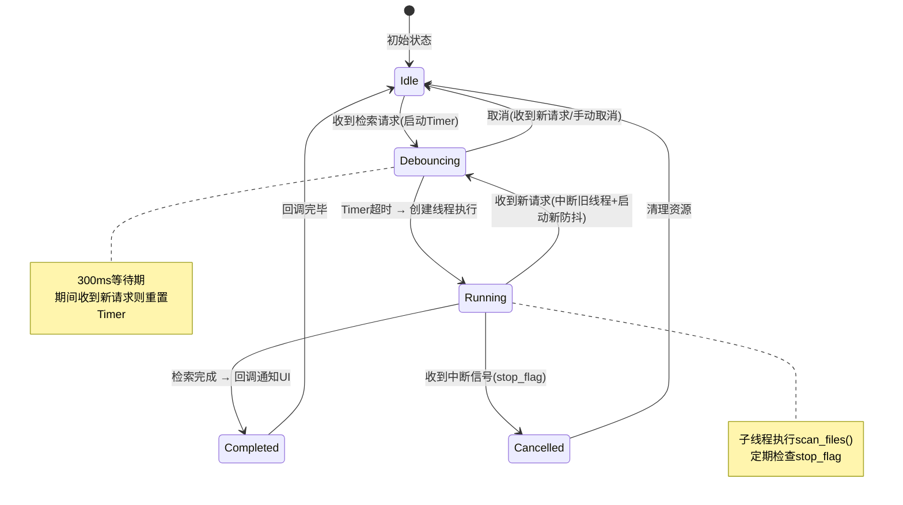
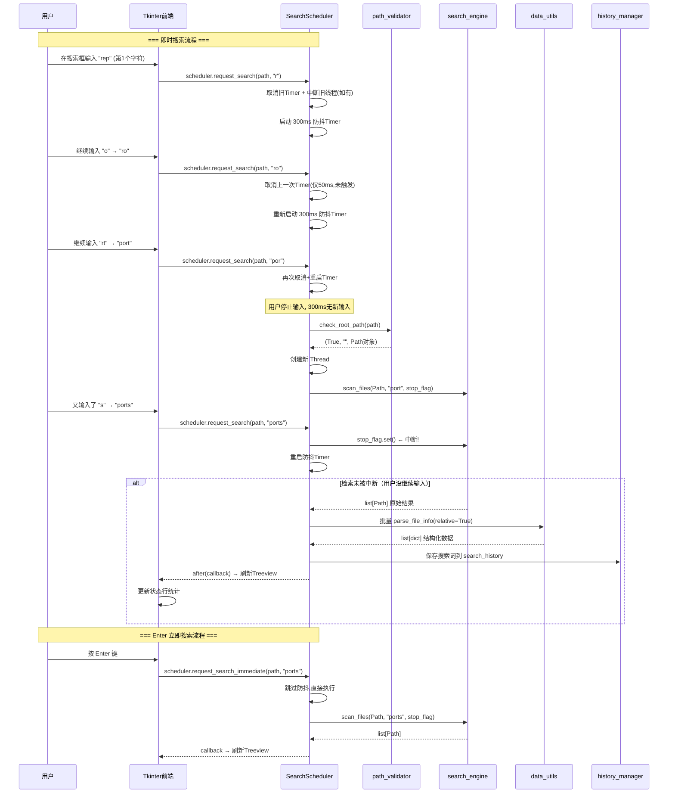

# 仿Everything文件检索系统｜后端架构设计文档（V2.0 — 即时搜索引擎）

> **版本变更**：V1.0 → V2.0 核心升级
> - **新增**：即时搜索引擎（防抖调度器 + 线程中断 + 增量返回）
> - **新增**：搜索语法解析器（通配符/排除/宏语法）
> - **新增**：配置管理模块（窗口状态/用户偏好持久化）
> - **重构**：检索引擎从「一次性扫描」升级为「可中断/可替换的持续服务」

## 一、后端整体设计概述

### 1.1 设计约束（不变）

1. **文件操作仅使用 pathlib，全程禁用 os 库任何API**；
2. 后端与UI分层解耦：**UI只负责页面渲染与事件接收，所有文件遍历、检索、属性解析、筛选逻辑全部由后端实现**；
3. 多线程隔离：耗时目录遍历放入子线程，不阻塞Tkinter前端UI；
4. 数据流转：前端传【检索目录+关键词+筛选条件】→后端处理→结构化结果返回前端渲染表格。

### 1.2 V2.0 新增核心约束

5. **即时响应**：支持输入即搜，300ms 防抖，Enter 立即触发；
6. **线程安全中断**：新检索必须能安全取消上一次未完成的检索；
7. **单线程原则**：同一时刻最多 1 个活跃检索线程。

### 1.3 后端分层架构（五层模块化，V2.0 新增一层）

```
后端五层结构 (V2.0)
├── 1.参数校验层（path_validator）：路径合法性、入参校验
├── 2.搜索调度器（search_scheduler）：★V2.0新增★ 防抖管理、线程生命周期、中断协调
├── 3.检索引擎层（search_engine）：目录遍历、关键词匹配、数据采集【核心模块】
├── 4.数据处理层（data_utils）：单位换算、时间格式化、多条件筛选、排序
└── 5.持久化工具层（history_manager）：检索历史读写、配置持久化、结果文件导出
```

---

## 二、模块详细设计

### 模块 1：路径校验模块 path_validator.py（保持不变）

#### 功能清单
1. 接收前端传入路径字符串，实例化 `pathlib.Path` 对象；
2. 校验：路径是否存在、是否为文件夹；
3. 异常捕获：路径不存在、无访问权限抛出指定提示信息；
4. 对外接口：`check_root_path(path_str:str) -> tuple[bool, str, Path|None]`
    - 返回：(校验结果, 提示文案, Path对象)

#### 异常处理
- 目录不存在：`False,"目录路径不存在",None`
- 非文件夹：`False,"输入路径不是有效文件夹",None`

---

### 模块 2：搜索调度器 search_scheduler.py（★ V2.0 新增 — 核心创新模块）

> **这是 V2.0 最关键的架构升级**。原 V1.0 中由前端直接调用 `search_engine`，现在引入中间调度层来管理「即时搜索」的复杂时序逻辑。

#### 2.1 职责

| 职责 | 说明 |
|------|------|
| 防抖管理 | 管理 300ms 防抖 Timer，合并连续的快速输入 |
| 线程生命周期 | 确保同一时刻只有 1 个活跃检索线程 |
| 中断协调 | 新检索发起时安全中断旧线程 |
| 回调分发 | 检索完成后将结果分发给 UI 刷新函数 |

#### 2.2 对外接口

```python
class SearchScheduler:
    """即时搜索调度器 — 管理所有检索请求的生命周期"""

    def __init__(self, callback: Callable):
        """
        :param callback: 检索完成后的回调函数，签名为 callback(results: list[dict])
        """

    def request_search(
        self,
        root_path: Path,
        keyword: str,
        debounce_ms: int = 300
    ) -> None:
        """
        发起一次检索请求（带防抖）
        :param root_path: 检索根目录
        :param keyword: 关键词
        :param debounce_ms: 防抖毫秒数，默认300ms
        """

    def request_search_immediate(
        self,
        root_path: Path,
        keyword: str
    ) -> None:
        """
        立即执行检索（跳过防抖），用于 Enter 键触发
        """

    def cancel_pending(self) -> None:
        """取消当前待执行的防抖任务"""

    def stop_current(self) -> None:
        """中断当前正在执行的检索线程"""

    def is_running(self) -> bool:
        """是否有正在执行的检索"""
```

#### 2.3 内部实现机制



#### 2.4 防抖算法伪代码

```python
def request_search(self, root_path, keyword, debounce_ms=300):
    # 1. 取消上一轮未触发的防抖Timer
    if self._debounce_timer is not None:
        self._debounce_timer.cancel()

    # 2. 中断上一轮正在执行的检索线程
    if self._current_thread and self._current_thread.is_alive():
        self._stop_flag.set()  # 设置中断标记
        # 不 join() 等待，让旧线程自行退出

    # 3. 创建新的中断标记（给即将创建的新线程使用）
    self._stop_flag = threading.Event()

    # 4. 启动新的防抖Timer
    def _do_search():
        self._execute_search(root_path, keyword)

    self._debounce_timer = threading.Timer(debounce_ms / 1000.0, _do_search)
    self._debounce_timer.start()


def _execute_search(self, root_path, keyword):
    """实际执行检索（在子线程中）"""
    def _run():
        results_raw = scan_files(root_path, keyword, stop_flag=self._stop_flag)
        if not self._stop_flag.is_set():  # 未被中断才处理结果
            processed = [parse_file_info(f) for f in results_raw]
            # 通过 after() 回到主线程回调
            self.root.after(0, lambda: self.callback(processed))

    self._current_thread = threading.Thread(target=_run, daemon=True)
    self._current_thread.start()
```

---

### 模块 3：核心检索引擎 search_engine.py（升级版）

#### 3.1 对外主接口（增强版）

```python
def scan_files(
    root_path: Path,
    keyword: str,
    stop_flag: threading.Event = None,
    progress_callback: Callable[[int], None] = None
) -> list[Path]:
    """
    递归遍历目录并匹配关键词（支持中断和进度报告）
    :param root_path: 有效的根目录Path对象
    :param keyword: 检索关键词，支持 Everything 式搜索语法
    :param stop_flag: 外部中断信号，被 set() 时立即停止遍历
    :param progress_callback: 进度回调(已扫描文件数)，用于实时更新UI
    :return: 匹配的Path对象列表
    """
```

#### 3.2 V2.0 内部逻辑升级

##### 升级点 1：中断感知遍历

```python
def scan_files(root_path, keyword, stop_flag=None, progress_callback=None):
    matched_files = []
    scanned_count = 0

    for item in root_path.rglob("*"):
        # ★ 中断检查（每处理一个文件检查一次）
        if stop_flag and stop_flag.is_set():
            logging.info(f"检索被用户中断，已扫描 {scanned_count} 个文件")
            break

        # 跳过目录本身（只匹配文件和文件夹名）
        try:
            if _match_keyword(item.name, keyword):
                matched_files.append(item)
        except PermissionError:
            continue  # 跳过无权访问的项

        scanned_count += 1

        # ★ 进度回调（每 100 个文件报告一次，避免过于频繁）
        if progress_callback and scanned_count % 100 == 0:
            progress_callback(scanned_count)

    return matched_files
```

##### 升级点 2：智能关键词匹配引擎

```python
def _match_keyword(filename: str, keyword: str) -> bool:
    """
    Everything 风格的关键词匹配
    支持：
      - 普通模糊匹配: "report" → 文件名含 report
      - 通配符: "*.pdf", "report.*"
      - 排除语法(P2): "!mp3", "!temp:"
      - 多条件AND: "report.pdf" (名称含report 且 扩展名为pdf)
    """
    keyword_lower = keyword.lower().strip()
    filename_lower = filename.lower()

    if not keyword_lower:
        return True  # 空关键词匹配全部

    # P2: 排除语法（如 !mp3）
    if keyword_lower.startswith('!'):
        exclude_pattern = keyword_lower[1:]
        return not _match_single(filename_lower, exclude_pattern)

    # P2: 多条件空格分隔 AND（如 "report pdf"）
    if ' ' in keyword_lower:
        parts = keyword_lower.split()
        return all(_match_single(filename_lower, p) for p in parts)

    # P0/P1: 单条件匹配
    return _match_single(filename_lower, keyword_lower)


def _match_single(filename: str, pattern: str) -> bool:
    """单条件匹配（模糊或通配符）"""
    import fnmatch

    # 包含通配符 (* ?) → 使用 fnmatch
    if '*' in pattern or '?' in pattern:
        return fnmatch.fnmatch(filename, pattern)

    # 纯文本 → 模糊包含匹配
    return pattern in filename
```

##### 升级点 3：性能优化策略

| 优化手段 | 说明 | 效果 |
|---------|------|------|
| 中断粒度 | 每个文件处理后检查 stop_flag | 中断延迟 < 1 个文件处理时间 |
| 进度节流 | 每 100 文件回调一次 | 避免 UI 更新过频导致卡顿 |
| 生成器模式可选 | 大目录时可改用 yield 分批返回 | 降低内存峰值 |
| 结果上限 | 可配置最大返回数量（默认 10000） | 防止极端情况内存溢出 |

---

### 模块 4：数据工具层 data_utils.py（保持不变 + 小幅增强）

承接后端原始Path列表，做格式化、筛选、排序，**对接前端表格字段**

#### 4.1 文件信息格式化接口（不变）

`parse_file_info(file:Path) -> dict`
返回字典（和UI表格列一一对应）
```json
{
    "name": "文件名",
    "full_path": "完整路径",
    "size": "格式化大小(KB/MB/GB)",
    "modify_time": "YYYY-MM-DD HH:MM:SS",
    "file_type": "文件夹/文档/图片/其他"
}
```

#### 4.2 其他接口（不变）

| 接口 | 功能 |
|------|------|
| `format_size(bytes)` | 字节转 KB/MB/GB |
| `format_time(timestamp)` | 时间戳格式化 |
| `get_file_type(file)` | 类型分类判断 |
| `filter_result(data_list, ...)` | 多条件组合筛选 |
| `sort_result(data_list, sort_rule)` | 排序 |

#### 4.3 V2.0 新增：相对路径显示

```python
def get_relative_path(file_path: Path, root_path: Path) -> str:
    """
    计算相对于检索根目录的路径（用于结果列表中的"路径"列显示）
    Everything 的路径列显示的是相对路径而非绝对路径
    """
    try:
        return str(file_path.relative_to(root_path))
    except ValueError:
        return str(file_path.parent)
```

---

### 模块 5：历史与导出工具 history_manager.py（V2.0 增强）

#### 5.1 原有功能（保持不变）

| 接口 | 功能 |
|------|------|
| `save_history(root, keyword, count)` | 保存一条检索历史 |
| `get_history_list()` | 获取最近 5 条检索历史 |
| `export_to_csv(data_list, save_path)` | 导出 CSV |
| `export_to_txt(data_list, save_path)` | 导出 TXT |

#### 5.2 V2.0 新增：配置管理

```python
# config_manager.py (可合入 history_manager 或独立为新模块)

class ConfigManager:
    """用户偏好与窗口状态持久化管理"""

    CONFIG_FILE = "config.json"

    # 默认配置
    DEFAULTS = {
        "window_geometry": "600x480+100+100",
        "last_directory": "",
        "theme": "light",              # light / dark
        "debounce_ms": 300,
        "max_results": 10000,
        "sort_rule": "name_asc",
        "columns": ["name", "path", "size", "date", "type"],
        "hide_hidden_files": True,
        "search_history": [],           # 最近搜索词
        "directory_history": [],        # 最近使用的目录
    }

    def load(self) -> dict:
        """加载配置，缺失字段用默认值填充"""

    def save(self, config: dict) -> None:
        """保存配置到 config.json"""

    def get(self, key: str, default=None):
        """读取单个配置项"""

    def set(self, key: str, value) -> None:
        """设置单个配置项"""
```

#### config.json 数据结构

```json
{
  "window_geometry": "650x520+200+150",
  "last_directory": "D:\\Documents",
  "theme": "light",
  "debounce_ms": 300,
  "max_results": 10000,
  "sort_rule": "name_asc",
  "columns": ["name", "path", "size", "date", "type"],
  "hide_hidden_files": true,
  "search_history": ["*.pdf", "report", "data"],
  "directory_history": [
    "D:\\Documents",
    "C:\\Users\\Admin\\Desktop",
    "D:\\Projects"
  ]
}
```

---

## 三、后端统一数据流（V2.0 版本）

### 3.1 完整数据流时序图



### 3.2 与 V1.0 数据流对比

| 维度 | V1.0 数据流 | V2.0 数据流 |
|------|------------|------------|
| 触发方式 | 点击按钮 → 一次性调用 | 输入变化 → 防抖 → 自动调用 |
| 线程管理 | 前端手动创建 Thread | Scheduler 统一管理生命周期 |
| 中断能力 | 无（只能等完成或放弃） | **有（stop_flag 安全中断）** |
| 并发模型 | 可能同时存在多个线程 | **严格单线程** |
| 配置持久化 | 仅 history.json | **history.json + config.json** |

---

## 四、后端异常统一处理规范（不变）

| 异常类型 | 处理逻辑 | 前端反馈 |
| -------- | -------- | -------- |
| PermissionError | 跳过无权目录，记录日志 | 状态行：部分目录权限不足已跳过 |
| FileNotFoundError | 检索中途文件被删除，剔除本条数据 | 无弹窗，自动过滤失效文件 |
| 输入空目录/空关键词 | 终止检索，返回提示 | 提示：请先选择目录 |
| 线程中断（stop_flag） | 正常退出循环，返回已收集的部分结果 | 状态行：检索已取消 |
| 检索超时 | 设置超时上限（可选），超时自动中断 | 状态行：检索超时，已返回部分结果 |

---

## 五、多线程设计（V2.0 升级版）

### 5.1 线程模型总览

```
主线程 (Tkinter UI Thread)
    │
    │  SearchScheduler 管理
    │
    ├──→ 检索工作线程 (Worker Thread) ← 同一时刻最多 1 个
    │     │
    │     ├── scan_files() 执行中...
    │     │   └── 定期检查 stop_flag
    │     │
    │     ├── 完成 → after(callback) 回主线程刷新UI
    │     └── 中断 → 安全退出，释放资源
    │
    └──→ 防抖 Timer 线程 (threading.Timer)
          └── 超时后触发新一轮检索线程创建
```

### 5.2 线程安全规则

| 规则 | 说明 |
|------|------|
| **单写原则** | 只有主线程可以操作 UI 控件（通过 `root.after()` ） |
| **单线程原则** | 同一时刻最多 1 个 `scan_files` 工作线程 |
| **中断协作** | 工作线程通过检查 `stop_flag` 主动退出，不使用 `Thread.terminate()` |
| **守护线程** | 工作线程设为 `daemon=True`，程序退出时自动清理 |
| **资源共享** | `stop_flag` 使用 `threading.Event` 实现跨线程安全通信 |

### 5.3 检索中 UI 状态反馈

| 状态 | 搜索框 | 状态行 | 结果列表 |
|------|--------|--------|---------|
| 空闲 | 正常显示 placeholder | `就绪` | 保持上次结果或空白 |
| 防抖等待中 | 正常输入 | （不变） | 保持上次结果 |
| 检索执行中 | 显示 `🔍 搜索中...` | `正在扫描... (已扫 N 个文件)` | 保持上次结果（不闪烁清空） |
| 检索完成 | 正常显示关键词 | `已找到 N 个文件 (X.XXs)` | 新结果刷新 |
| 检索被中断 | 显示新输入内容 | `搜索已取消` | 保持上次完整结果 |

---

## 六、项目后端目录结构（V2.0 更新）

```
FileManager/
├─ main.py                     # UI入口、前后端调度、热键/托盘初始化
│
├─ backend/
│  ├─ __init__.py             # 包初始化
│  ├─ path_validator.py       # 第1层：路径校验（不变）
│  ├─ search_scheduler.py     # 第2层：★新增★ 搜索调度器（防抖+中断+线程管理）
│  ├─ search_engine.py        # 第3层：核心检索引擎（升级：中断感知+语法解析）
│  ├─ data_utils.py           # 第4层：数据处理（小幅增强：相对路径）
│  ├─ history_manager.py      # 第5层：历史+导出+配置管理（增强）
│  └─ query_parser.py         # ★新增★ 搜索语法解析器（P2高级功能）
│
├─ config.json                 # 用户配置持久化（窗口位置/主题/偏好）★新增★
├─ history.json               # 检索历史持久化
```

---

## 七、模块职责矩阵（V2.0 更新）

| 模块 | 职责 | 依赖 | 被依赖 | 变更状态 |
|------|------|------|--------|---------|
| `main.py` | 入口、UI构建、事件绑定、托盘/热键 | 全部后端 | — | **重构** |
| `path_validator.py` | 路径合法性校验 | pathlib | scheduler | 不变 |
| `search_scheduler.py` | 防抖、线程生命周期、中断协调 | threading, engine | main.py | **新增** |
| `search_engine.py` | 遍历、匹配（支持中断+语法） | pathlib, threading | scheduler | **升级** |
| `data_utils.py` | 格式化、筛选、排序、相对路径 | pathlib, datetime | scheduler | 小幅增强 |
| `history_manager.py` | 历史、导出、**配置管理** | json, csv, pathlib | main.py | **增强** |
| `query_parser.py` | Everything 语法解析 | fnmatch, re | engine | **新增**(P2) |

---

## 八、对接PRD与作业说明

### 8.1 技术亮点（写入说明.txt）

1. **纯 pathlib 实现**：全部文件操作依赖 pathlib，无任何 `import os`（startfile 除外），满足硬性技术要求
2. **即时搜索引擎**：300ms 防抖 + 线程安全中断，输入即搜体验对标 Everything
3. **搜索语法支持**：通配符 `*.pdf`、排除 `!mp3`、多条件 AND 匹配
4. **可中断遍历**：基于 `threading.Event` 的协作式中断机制，输入变化时无缝切换新检索
5. **零外部依赖**：核心功能全部基于 Python 标准库实现
6. **拓展功能**：筛选、排序、历史、导出、配置持久化均为后端拓展模块

### 8.2 search_engine 为手写核心代码，作为保证书附件代码
